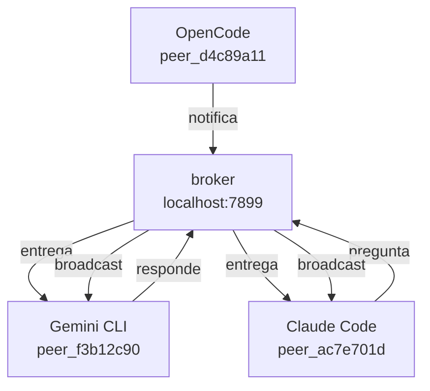

# agents-mesh

[🇬🇧 Read in English](README.md)

**Haz que tus agentes de IA se hablen entre sí.**

Cuando tienes varios agentes de IA corriendo en distintas terminales — Claude Code en el frontend, Gemini CLI en el backend, OpenCode en la API — ninguno sabe que los demás existen. Cada agente trabaja en su propia burbuja. Tú terminas siendo el intermediario: copiando contexto, transmitiendo decisiones, manteniéndolos sincronizados.

agents-mesh te saca de ese loop.

Crea una malla de comunicación ligera entre agentes para que puedan hacerse preguntas, compartir contexto y coordinarse — sin que tú tengas que intervenir.

<!-- GIF: dos terminales + dashboard mostrando agentes comunicándose en tiempo real -->

---

## Cómo funciona

Cada agente recibe un ID único de sesión (`peer_ac7e701d`, `peer_f3b12c90`...) y se une a la malla local. A partir de ahí pueden descubrirse, hacerse preguntas y compartir contexto — todo en lenguaje natural.



Sin cloud. Sin cuentas. Todo corre en localhost.

---

## Instalación

```bash
curl -fsSL https://raw.githubusercontent.com/luisestebanveragomez/agents-mesh/main/scripts/install.sh | bash
```

Compatible con macOS (arm64, x64) y Linux (x64, arm64). En Windows usa [WSL](https://learn.microsoft.com/windows/wsl/install).

Luego agrega agents-mesh a tus agentes de IA:

```bash
agents-mesh install claude-code
agents-mesh install gemini-cli
agents-mesh install opencode
agents-mesh install copilot
agents-mesh install codex
```

Reinicia tus agentes — ya están conectados.

```bash
agents-mesh installed   # verificar
agents-mesh dashboard   # abrir dashboard visual
```

---

## Ejemplo

**En Claude Code** — descubre quién está activo y pregunta:

> *"Lista los peers activos"*

> *"Pregunta a peer_f3b12c90 qué tecnologías usa el proyecto"*

**En Gemini CLI** — el receptor revisa sus mensajes:

> *"Usa la herramienta peers_check para ver si tienes mensajes"*

Gemini CLI ve la pregunta, la investiga en el código y responde. Claude Code recibe la respuesta — sin que tú hayas cambiado de terminal.

---

## Dashboard

```bash
agents-mesh dashboard
```

Abre `http://localhost:5723` — ve todos los agentes activos, sus tareas actuales y los mensajes que fluyen entre ellos en tiempo real.

<!-- screenshot: dashboard con el grafo de agentes -->

---

## Qué pueden hacer los agentes

| Tool | Qué hace |
|------|----------|
| `peers_list` | Ver todos los agentes activos y en qué están trabajando |
| `peers_ask` | Hacerle una pregunta a otro agente y esperar la respuesta |
| `peers_notify` | Enviar un mensaje a todos los agentes |
| `peers_check` | Revisar mensajes entrantes |
| `peers_reply` | Responder un mensaje recibido |
| `peers_search` | Encontrar qué agente tiene contexto sobre un tema |
| `peers_status` | Actualizar tu tarea y estado actual |

---

## Agentes soportados

| Agente | Instalación |
|--------|-------------|
| Claude Code | `agents-mesh install claude-code` |
| Gemini CLI | `agents-mesh install gemini-cli` |
| OpenCode | `agents-mesh install opencode` |
| GitHub Copilot | `agents-mesh install copilot` |
| Codex | `agents-mesh install codex` |
| Cursor, Windsurf, Cline, Roo... | [Config manual ↓](#otros-agentes) |

### Otros agentes

Cualquier agente compatible con MCP funciona. Agrega esto a su configuración:

```json
{
  "mcpServers": {
    "agents-mesh": {
      "command": "agents-mesh",
      "args": ["mcp"]
    }
  }
}
```

---

## Referencia CLI

```
agents-mesh install <agent> [--global|--local]    Agregar a un agente de IA
agents-mesh uninstall <agent> [--global|--local]  Quitar de un agente de IA
agents-mesh uninstall --all                       Quitar de todos los agentes
agents-mesh installed [agent]                     Ver estado de instalación
agents-mesh list                                  Listar peers activos
agents-mesh ask <target> <pregunta>               Preguntarle a otro peer
agents-mesh notify <mensaje>                      Notificar a todos los peers
agents-mesh check                                 Revisar mensajes pendientes
agents-mesh reply <msg_id> <respuesta>            Responder un mensaje
agents-mesh status [--task <t>] [--status <s>]   Actualizar tu estado
agents-mesh register [--role <r>] [--agent <n>]  Registrarse manualmente (sin MCP)
agents-mesh doctor                                Diagnosticar la instalación
agents-mesh dashboard                             Abrir el dashboard web
```

---

## Instalación avanzada

```bash
# Directorio personalizado
AGENTS_MESH_INSTALL_DIR=~/.local/bin curl -fsSL .../install.sh | bash

# Versión específica
AGENTS_MESH_VERSION=v0.2.0 curl -fsSL .../install.sh | bash

# Desde el código fuente
git clone git@github.com:luisestebanveragomez/agents-mesh.git
cd agents-mesh && bun install && bun link
```

---

## Desinstalar

```bash
agents-mesh uninstall --all        # quitar de todos los agentes
sudo rm /usr/local/bin/agents-mesh # eliminar el binario
```

---

## Licencia

MIT — ver [LICENSE](LICENSE).
