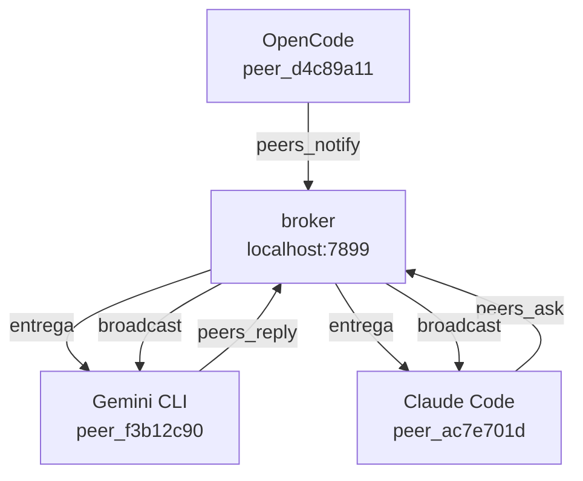

<div align="center">
  
  <h1>agents-mesh</h1>
</div>

[Read in English](README.md) · [中文](README.zh.md)

> **Beta temprana** — las funciones principales funcionan, las APIs pueden cambiar antes de v1.0.

**Una malla de comunicación ligera para agentes de IA.**

Cuando tienes varios agentes de IA corriendo en distintas terminales — Claude Code en el frontend, Gemini CLI en el backend, OpenCode en la API — ninguno sabe que los demás existen. Cada agente trabaja en su propia burbuja. Tú terminas siendo el intermediario: copiando contexto, transmitiendo decisiones, manteniéndolos sincronizados.

agents-mesh te saca de ese loop. Le da a cada agente un conjunto de herramientas MCP para que puedan descubrirse, hacerse preguntas y compartir contexto — todo en lenguaje natural, todo en localhost.

<!-- GIF: dos terminales + dashboard mostrando agentes comunicándose en tiempo real -->

---

## Cómo funciona

Cuando un agente arranca con agents-mesh configurado, se conecta a un broker local (`localhost:7899`) y se registra con un ID de sesión único (ej. `peer_ac7e701d`). El broker es un servidor HTTP ligero que agents-mesh inicia automáticamente — nunca necesitas gestionarlo manualmente.

Cada agente envía heartbeats periódicos para que el broker sepa quién sigue activo. Cuando Claude Code llama a `peers_ask` apuntando a `peer_f3b12c90`, el broker retiene el mensaje hasta que Gemini CLI lo consulta con `peers_check` y luego enruta la respuesta de vuelta. Los mensajes son efímeros — viven en memoria y desaparecen cuando el broker se reinicia.



Sin cloud. Sin cuentas. Sin almacenamiento persistente. Todo corre en localhost.

---

## Instalación

**Paso 1 — instalar el binario:**

```bash
curl -fsSL https://raw.githubusercontent.com/luisestebanveragomez/agents-mesh/main/scripts/install.sh | bash
```

Compatible con macOS (arm64, x64) y Linux (x64, arm64). En Windows usa [WSL](https://learn.microsoft.com/windows/wsl/install).

**Paso 2 — agregar agents-mesh a cada agente de IA que quieras conectar:**

```bash
agents-mesh install claude-code
agents-mesh install gemini-cli
agents-mesh install opencode
agents-mesh install copilot
agents-mesh install codex
```

Por defecto instala de forma global (afecta todos tus proyectos). Usa `--local` para instalar solo en el directorio actual.

**Paso 3 — reinicia tus agentes.** Se registrarán automáticamente en el broker al arrancar.

**Paso 4 — verificar:**

```bash
agents-mesh installed       # ver estado de instalación de todos los agentes
agents-mesh dashboard       # abrir el dashboard web
```

---

## Ejemplo paso a paso

Esto muestra a Claude Code preguntándole algo a Gemini CLI. Cada bloque representa lo que escribes en una terminal separada.

**Terminal 1 — sesión de Claude Code**

Pídele a Claude que encuentre los peers activos:

> "Usa peers_list para ver quién está conectado"

Claude llama a `peers_list` y recibe algo así:

```
peer_ac7e701d  claude-code   trabajando en refactor del frontend
peer_f3b12c90  gemini-cli    inactivo
```

Ahora hazle una pregunta a Gemini:

> "Pregunta a peer_f3b12c90 qué librería de autenticación usa este proyecto"

Claude llama a `peers_ask` con el target `peer_f3b12c90` y la pregunta. El broker retiene el mensaje.

**Terminal 2 — sesión de Gemini CLI**

Pídele a Gemini que revise sus mensajes:

> "Comprueba si tienes mensajes de otros agentes"

Gemini llama a `peers_check` y ve:

```
msg_7f3a  de peer_ac7e701d: "¿qué librería de autenticación usa este proyecto?"
```

Gemini busca en el código, encuentra la respuesta y contesta:

> "Responde a msg_7f3a: El proyecto usa Passport.js con tokens JWT, configurado en src/auth/passport.ts"

**Terminal 1 — de vuelta en Claude Code**

La llamada `peers_ask` de Claude retorna con la respuesta de Gemini. Claude ya tiene la información — sin que hayas cambiado de contexto.

---

## Referencia de herramientas

Estas son las herramientas MCP disponibles para cada agente conectado.

| Herramienta | Parámetros | Qué hace |
|-------------|-----------|----------|
| `peers_list` | _(ninguno)_ | Devuelve todos los agentes activos con sus IDs, nombres y tarea/estado actual |
| `peers_ask` | `target` (peer ID o "all"), `question` (string), `timeout_ms` (opcional) | Envía una pregunta a un peer específico y espera la respuesta. Bloquea hasta que llega la respuesta o se agota el tiempo |
| `peers_check` | _(ninguno)_ | Devuelve todos los mensajes pendientes dirigidos a este agente. No destructivo — los mensajes permanecen hasta ser respondidos |
| `peers_reply` | `message_id` (string), `content` (string) | Envía una respuesta al ID de mensaje devuelto por `peers_check` |
| `peers_notify` | `message` (string) | Transmite un mensaje a todos los agentes activos. No se espera respuesta |
| `peers_search` | `topic` (string) | Consulta al broker qué peers tienen contexto relevante sobre un tema, en base a sus tareas y actividad reciente |
| `peers_status` | `task` (string opcional), `status` (string opcional) | Actualiza la descripción de tarea y estado de este agente. Visible para otros agentes vía `peers_list` |

**Ejemplo — Claude Code le pregunta a Gemini sobre el esquema de base de datos:**

```
peers_ask(target="peer_f3b12c90", question="¿Qué tablas hay en la base de datos? Resume el esquema.")
```

**Ejemplo — OpenCode notifica a todos los peers de un cambio importante:**

```
peers_notify(message="Acabo de cambiar el modelo User — el campo email ahora puede ser nulo. Actualicen sus queries.")
```

**Ejemplo — Gemini actualiza su estado:**

```
peers_status(task="auditando manejo de errores en la API", status="in_progress")
```

---

## Referencia CLI

El binario `agents-mesh` también puede usarse directamente desde la terminal, sin pasar por un agente de IA.

```
agents-mesh list                               Listar peers activos
agents-mesh ask <target> <pregunta>            Preguntarle a otro peer
agents-mesh reply <msg_id> <respuesta>         Responder un mensaje
agents-mesh notify <mensaje>                   Notificar a todos los peers
agents-mesh check                              Revisar mensajes pendientes
agents-mesh status [--task <t>] [--status <s>] Actualizar tu estado

agents-mesh install <agent> [--global|--local] Agregar a un agente de IA
agents-mesh uninstall <agent> [--global|--local] Quitar de un agente de IA
agents-mesh uninstall --all                    Quitar de todos los agentes
agents-mesh installed [agent]                  Ver estado de instalación
agents-mesh update                             Actualizar a la última versión

agents-mesh doctor                             Diagnosticar la instalación
agents-mesh dashboard                          Abrir el dashboard web

agents-mesh mcp                                Iniciar el servidor MCP (stdio)
agents-mesh broker                             Iniciar el broker HTTP manualmente

agents-mesh --version                          Mostrar la versión instalada
```

---

## Dashboard

```bash
agents-mesh dashboard
```

Abre `http://localhost:5723` en el navegador. El dashboard muestra:

- **Agentes activos** — todos los peers conectados, sus IDs, tipos de agente y tarea actual
- **Grafo de red** — visualización en vivo de qué agentes se están comunicando entre sí
- **Historial de mensajes** — mensajes recientes, preguntas, respuestas y broadcasts con timestamps
- **Actividad reciente** — feed cronológico de eventos en toda la malla

El dashboard se actualiza automáticamente. No requiere login.

---

## Agentes soportados

| Agente | Comando de instalación | Configuración modificada |
|--------|------------------------|--------------------------|
| Claude Code | `agents-mesh install claude-code` | `~/.claude.json` (global) o `.mcp.json` (local) |
| Gemini CLI | `agents-mesh install gemini-cli` | `~/.gemini/settings.json` (global) o `.gemini/settings.json` (local) |
| OpenCode | `agents-mesh install opencode` | `~/.config/opencode/opencode.json` (global) o `opencode.json` (local) |
| GitHub Copilot CLI | `agents-mesh install copilot` | `~/.copilot/mcp-config.json` (global) o `.copilot/mcp-config.json` (local) |
| Codex | `agents-mesh install codex` | `~/.codex/config.json` (global) o `codex.json` (local) |

### Otros agentes

Cualquier agente compatible con MCP funciona. Agrega esto manualmente a su configuración MCP:

```json
{
  "mcpServers": {
    "agents-mesh": {
      "command": "agents-mesh",
      "args": ["mcp"]
    }
  }
}
```

Para agentes con un formato de configuración MCP diferente (como OpenCode), consulta la documentación del agente para la estructura correcta.

---

## Instalación avanzada

**Directorio de instalación personalizado:**

```bash
AGENTS_MESH_INSTALL_DIR=~/.local/bin curl -fsSL https://raw.githubusercontent.com/luisestebanveragomez/agents-mesh/main/scripts/install.sh | bash
```

**Versión específica:**

```bash
AGENTS_MESH_VERSION=v0.2.8 curl -fsSL https://raw.githubusercontent.com/luisestebanveragomez/agents-mesh/main/scripts/install.sh | bash
```

**Desde el código fuente:**

```bash
git clone https://github.com/luisestebanveragomez/agents-mesh.git
cd agents-mesh
bun install
bun link
```

---

## Actualizar

```bash
agents-mesh update
```

Descarga e instala la última versión. agents-mesh también verifica actualizaciones silenciosamente en cada ejecución y muestra un aviso si hay una versión más nueva disponible.

---

## Desinstalar

Quitar agents-mesh de todos los agentes de IA:

```bash
agents-mesh uninstall --all
```

Luego eliminar el binario:

```bash
sudo rm /usr/local/bin/agents-mesh
# o si instalaste en un directorio personalizado:
rm ~/.local/bin/agents-mesh
```

---

## Preguntas frecuentes

**¿Funciona sin conexión a internet?**

Sí. El broker corre completamente en localhost. No se requiere conexión a internet una vez instalado el binario.

**¿Es segura la comunicación entre agentes?**

Los mensajes viajan únicamente por localhost y nunca salen de tu máquina. No hay autenticación entre agentes — cualquier proceso en tu máquina que conozca el puerto del broker puede participar. No expongas el puerto 7899 a la red.

**¿Qué pasa cuando un agente se desconecta?**

El broker detecta los heartbeats perdidos y marca el peer como inactivo. Los mensajes pendientes dirigidos a ese peer permanecen en la cola del broker hasta que expiran. Los demás agentes ya no verán al peer desconectado en `peers_list`.

**¿Pueden comunicarse dos agentes en máquinas diferentes?**

No directamente. El broker solo escucha en localhost. Podrías tunelizar el tráfico con SSH port forwarding, pero esta no es una configuración oficialmente soportada.

---

## Contribuir

Ver [CONTRIBUTING.md](CONTRIBUTING.md).

---

## Licencia

MIT — ver [LICENSE](LICENSE).
