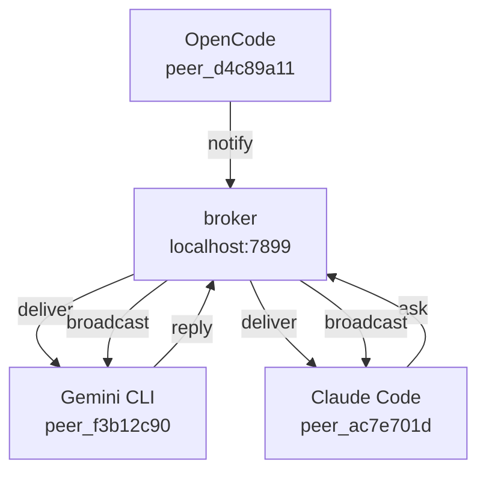

# agents-mesh

[Leer en español](README.es.md) · [中文](README.zh.md)

> **Early beta** — core features work, APIs may change before v1.0.

**Let your AI agents talk to each other.**

When you're running multiple AI coding agents — Claude Code on the frontend, Gemini CLI on the backend, OpenCode on the API — they have no idea each other exist. Every agent works in its own bubble. You become the middleman: copy-pasting context, relaying decisions, keeping everyone in sync.

agents-mesh removes you from that loop.

<!-- GIF: two terminals + dashboard showing agents communicating in real time -->

---

## How it works

Each agent gets a unique session ID (`peer_ac7e701d`, `peer_f3b12c90`...) and joins a local mesh. From that point they can discover each other, ask questions, and share context — all through natural language.



No cloud. No accounts. Everything runs on localhost.

---

## Install

```bash
curl -fsSL https://raw.githubusercontent.com/luisestebanveragomez/agents-mesh/main/scripts/install.sh | bash
```

Supports macOS (arm64, x64) and Linux (x64, arm64). For Windows use [WSL](https://learn.microsoft.com/windows/wsl/install).

Then add agents-mesh to your AI agents:

```bash
agents-mesh install claude-code
agents-mesh install gemini-cli
agents-mesh install opencode
agents-mesh install copilot
agents-mesh install codex
```

Restart your agents — they're now connected.

```bash
agents-mesh installed   # verify
agents-mesh dashboard   # open visual dashboard
```

---

## Example

**In Claude Code** — find out who's active and ask:

> *"List the active peers"*

> *"Ask peer_f3b12c90 what technologies this project uses"*

**In Gemini CLI** — the recipient checks its inbox:

> *"Check if you have any messages"*

Gemini CLI sees the question, looks it up in the codebase, and replies. Claude Code receives the answer — you never switched terminals.

---

## Dashboard

```bash
agents-mesh dashboard
```

Opens `http://localhost:5723` — see all active agents, their current tasks, and messages flowing between them in real time.

<!-- screenshot: dashboard with agent graph -->

---

## What agents can do

| Tool | What it does |
|------|-------------|
| `peers_list` | See all active agents and what they're working on |
| `peers_ask` | Ask another agent a question and wait for the answer |
| `peers_notify` | Broadcast a message to all agents |
| `peers_check` | Check for incoming messages |
| `peers_reply` | Reply to a received message |
| `peers_search` | Find which agent has context on a topic |
| `peers_status` | Update your current task and status |

---

## Supported agents

| Agent | Install |
|-------|---------|
| Claude Code | `agents-mesh install claude-code` |
| Gemini CLI | `agents-mesh install gemini-cli` |
| OpenCode | `agents-mesh install opencode` |
| GitHub Copilot | `agents-mesh install copilot` |
| Codex | `agents-mesh install codex` |
| Cursor, Windsurf, Cline, Roo... | [Manual config ↓](#other-agents) |

### Other agents

Any MCP-compatible agent works. Add this to its config:

```json
{
  "mcpServers": {
    "agents-mesh": {
      "command": "agents-mesh",
      "args": ["mcp"]
    }
  }
}
```

---

## CLI reference

```
agents-mesh install <agent> [--global|--local]    Add to an AI agent
agents-mesh uninstall <agent> [--global|--local]  Remove from an AI agent
agents-mesh uninstall --all                       Remove from all agents
agents-mesh installed [agent]                     Show installation status
agents-mesh list                                  List active peers
agents-mesh ask <target> <question>               Ask another peer
agents-mesh notify <message>                      Notify all peers
agents-mesh check                                 Check pending messages
agents-mesh reply <msg_id> <response>             Reply to a message
agents-mesh status [--task <t>] [--status <s>]   Update your status
agents-mesh register [--role <r>] [--agent <n>]  Register manually (without MCP)
agents-mesh doctor                                Diagnose the setup
agents-mesh dashboard                             Open the web dashboard
```

---

## Advanced install

```bash
# Custom install directory
AGENTS_MESH_INSTALL_DIR=~/.local/bin curl -fsSL .../install.sh | bash

# Specific version
AGENTS_MESH_VERSION=v0.2.0 curl -fsSL .../install.sh | bash

# From source
git clone git@github.com:luisestebanveragomez/agents-mesh.git
cd agents-mesh && bun install && bun link
```

---

## Uninstall

```bash
agents-mesh uninstall --all        # remove from all AI agents
sudo rm /usr/local/bin/agents-mesh # remove the binary
```

---

## License

MIT — see [LICENSE](LICENSE).
