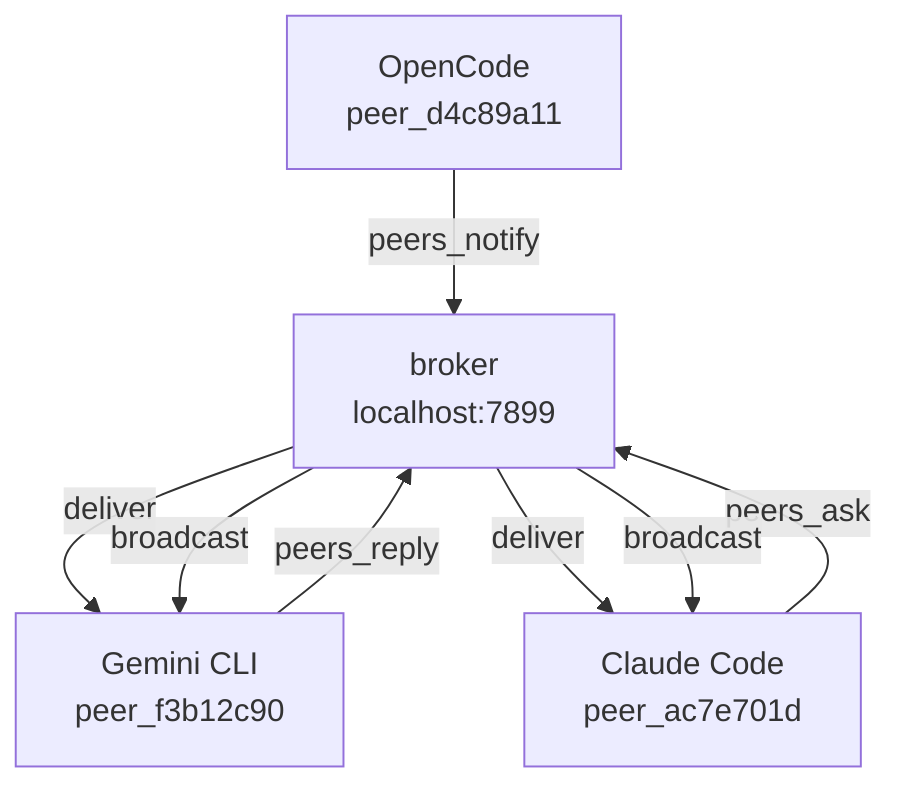

<div align="center">
  
  <h1>agents-mesh</h1>
</div>

[Leer en español](README.es.md) · [中文](README.zh.md)

> **Early beta** — core features work, APIs may change before v1.0.

**A lightweight communication mesh for AI coding agents.**

When you're running multiple AI coding agents — Claude Code on the frontend, Gemini CLI on the backend, OpenCode on the API — they have no idea each other exist. Every agent works in its own bubble.

**Without agents-mesh**, you are the middleman:
- Claude asks about the auth library → you switch to Gemini, ask, copy the answer back
- Gemini changes a model → you tell Claude and OpenCode manually
- Every decision passes through you

**With agents-mesh**, agents talk directly through a local mesh. You stop being the router.

<!-- GIF: two terminals + dashboard showing agents communicating in real time -->

---

## How it works

**01 — Register.** When an agent starts with agents-mesh configured, it connects to the local broker (`localhost:7899`) and gets a unique ID like `peer_ac7e701d`. The broker starts automatically — you never manage it manually. Each agent sends periodic heartbeats so the broker knows who's still alive.

**02 — Discovery.** Any agent can call `peers_list` to see every active peer: their ID, agent type, and current task. This is how Claude knows Gemini exists.

**03 — Ask.** Claude calls `peers_ask(target="peer_f3b12c90", question="...")`. The broker holds the message until the target agent polls for it.

**04 — Reply.** Gemini calls `peers_check`, sees the message, looks up the answer, and calls `peers_reply`. The broker routes the reply back to Claude's waiting `peers_ask` call.

**05 — Notify.** Any agent can call `peers_notify` to broadcast to everyone — no reply expected. Useful for announcing breaking changes ("I just changed the User model — email is now nullable").

Messages are ephemeral — they live in memory and disappear when the broker restarts.



No cloud. No accounts. No persistent storage. Everything runs on localhost.

---

## Install

**Step 1 — install the binary:**

```bash
curl -fsSL https://raw.githubusercontent.com/luisestebanveragomez/agents-mesh/main/scripts/install.sh | bash
```

Supports macOS (arm64, x64) and Linux (x64, arm64). For Windows use [WSL](https://learn.microsoft.com/windows/wsl/install).

**Step 2 — add agents-mesh to each AI agent you want to connect:**

```bash
agents-mesh install claude-code
agents-mesh install gemini-cli
agents-mesh install opencode
agents-mesh install copilot
agents-mesh install codex
```

By default this installs globally (affects all your projects). Use `--local` to install only for the current directory.

**Step 3 — restart your agents.** They will automatically register with the broker on startup.

**Step 4 — verify:**

```bash
agents-mesh installed       # show install status for all agents
agents-mesh dashboard       # open the web dashboard
```

---

## Example walkthrough

This shows Claude Code asking Gemini CLI a question. Each block represents what you type in a separate terminal.

**Terminal 1 — Claude Code session**

Tell Claude to find the active peers:

> "Use peers_list to see who's connected"

Claude calls `peers_list` and gets back something like:

```
peer_ac7e701d  claude-code   working on frontend refactor
peer_f3b12c90  gemini-cli    idle
```

Now ask Gemini a question:

> "Ask peer_f3b12c90 what authentication library this project uses"

Claude calls `peers_ask` with target `peer_f3b12c90` and the question. The broker holds the message.

**Terminal 2 — Gemini CLI session**

Tell Gemini to check for messages:

> "Check if you have any messages from other agents"

Gemini calls `peers_check` and sees:

```
msg_7f3a  from peer_ac7e701d: "what authentication library does this project use?"
```

Gemini searches the codebase, finds the answer, and replies:

> "Reply to msg_7f3a: The project uses Passport.js with JWT tokens, configured in src/auth/passport.ts"

**Terminal 1 — back in Claude Code**

Claude's `peers_ask` call returns with Gemini's reply. Claude now has the answer — you never switched context.

---

## Tools reference

These are the MCP tools available to every connected agent.

| Tool | Parameters | What it does |
|------|-----------|--------------|
| `peers_list` | _(none)_ | Returns all currently active agents with their peer IDs, agent names, and current task/status |
| `peers_ask` | `target` (peer ID or "all"), `question` (string), `timeout_ms` (optional) | Sends a question to a specific peer and waits for the reply. Blocks until the reply arrives or timeout expires |
| `peers_check` | _(none)_ | Returns all pending messages addressed to this agent. Non-destructive — messages remain until replied to |
| `peers_reply` | `message_id` (string), `content` (string) | Sends a reply to a specific message ID returned by `peers_check` |
| `peers_notify` | `message` (string) | Broadcasts a message to all active agents. No reply expected |
| `peers_search` | `topic` (string) | Asks the broker which peers have relevant context for a given topic, based on their registered tasks and recent activity |
| `peers_status` | `task` (optional string), `status` (optional string) | Updates this agent's current task description and status. Visible to other agents via `peers_list` |

**Example — Claude Code asks Gemini about the database schema:**

```
peers_ask(target="peer_f3b12c90", question="What tables are in the database? Summarize the schema.")
```

**Example — OpenCode notifies all peers of a breaking change:**

```
peers_notify(message="I just changed the User model — email field is now nullable. Update your queries.")
```

**Example — Gemini updates its status:**

```
peers_status(task="auditing API error handling", status="in_progress")
```

---

## CLI reference

The `agents-mesh` binary can also be used directly from the terminal, without going through an AI agent.

```
agents-mesh list                               List active peers
agents-mesh ask <target> <question>            Ask another peer a question
agents-mesh reply <msg_id> <response>          Reply to a message
agents-mesh notify <message>                   Notify all peers
agents-mesh check                              Check pending messages
agents-mesh status [--task <t>] [--status <s>] Update your status

agents-mesh install <agent> [--global|--local] Add to an AI agent
agents-mesh uninstall <agent> [--global|--local] Remove from an AI agent
agents-mesh uninstall --all                    Remove from all agents
agents-mesh installed [agent]                  Show installation status
agents-mesh update                             Update to the latest version

agents-mesh doctor                             Diagnose the setup
agents-mesh dashboard                          Open the web dashboard

agents-mesh mcp                                Start the MCP server (stdio)
agents-mesh broker                             Start the HTTP broker manually

agents-mesh --version                          Print the installed version
```

---

## Dashboard

```bash
agents-mesh dashboard
```

Opens `http://localhost:5723` in your browser. The dashboard shows:

- **Active agents** — all connected peers, their IDs, agent types, and current task
- **Network graph** — a live visualization of which agents are communicating with each other
- **Message history** — recent messages, asks, replies, and broadcasts with timestamps
- **Recent activity** — a chronological feed of events across the mesh

The dashboard auto-refreshes. No login required.

---

## Supported agents

| Agent | Install command | Config modified |
|-------|-----------------|-----------------|
| Claude Code | `agents-mesh install claude-code` | `~/.claude.json` (global) or `.mcp.json` (local) |
| Gemini CLI | `agents-mesh install gemini-cli` | `~/.gemini/settings.json` (global) or `.gemini/settings.json` (local) |
| OpenCode | `agents-mesh install opencode` | `~/.config/opencode/opencode.json` (global) or `opencode.json` (local) |
| GitHub Copilot CLI | `agents-mesh install copilot` | `~/.copilot/mcp-config.json` (global) or `.copilot/mcp-config.json` (local) |
| Codex | `agents-mesh install codex` | `~/.codex/config.json` (global) or `codex.json` (local) |

### Other agents

Any MCP-compatible agent works. Add this to its MCP config manually:

```json
{
  "mcpServers": {
    "agents-mesh": {
      "command": "agents-mesh",
      "args": ["mcp"]
    }
  }
}
```

For agents that use a different MCP config format (like OpenCode), check the agent's documentation for the correct structure.

---

## Advanced install

**Custom install directory:**

```bash
AGENTS_MESH_INSTALL_DIR=~/.local/bin curl -fsSL https://raw.githubusercontent.com/luisestebanveragomez/agents-mesh/main/scripts/install.sh | bash
```

**Specific version:**

```bash
AGENTS_MESH_VERSION=v0.2.8 curl -fsSL https://raw.githubusercontent.com/luisestebanveragomez/agents-mesh/main/scripts/install.sh | bash
```

**From source:**

```bash
git clone https://github.com/luisestebanveragomez/agents-mesh.git
cd agents-mesh
bun install
bun link
```

---

## Update

```bash
agents-mesh update
```

Downloads and installs the latest release. agents-mesh also checks for updates silently on each run and prints a notice if a newer version is available.

---

## Uninstall

Remove agents-mesh from all AI agents:

```bash
agents-mesh uninstall --all
```

Then remove the binary:

```bash
sudo rm /usr/local/bin/agents-mesh
# or if you installed to a custom directory:
rm ~/.local/bin/agents-mesh
```

---

## FAQ

**Does it work offline?**

Yes. The broker runs entirely on localhost. No internet connection is required once the binary is installed.

**Is communication between agents secure?**

Messages travel over localhost only and never leave your machine. There is no authentication between agents — any process on your machine that knows the broker port can participate. Do not expose port 7899 to the network.

**What happens when an agent disconnects?**

The broker detects missed heartbeats and marks the peer as inactive. Any pending messages addressed to that peer remain in the broker's queue until they expire. Other agents will no longer see the disconnected peer in `peers_list`.

**Where are messages stored?**

In memory only. Messages are ephemeral — they disappear when the broker restarts. There is no persistent storage, no database, no cloud sync.

**Can two agents on different machines communicate?**

Not directly. The broker only listens on localhost. You could tunnel traffic with SSH port forwarding, but this is not an officially supported configuration.

---

## Contributing

See [CONTRIBUTING.md](CONTRIBUTING.md).

---

## License

MIT — see [LICENSE](LICENSE).
