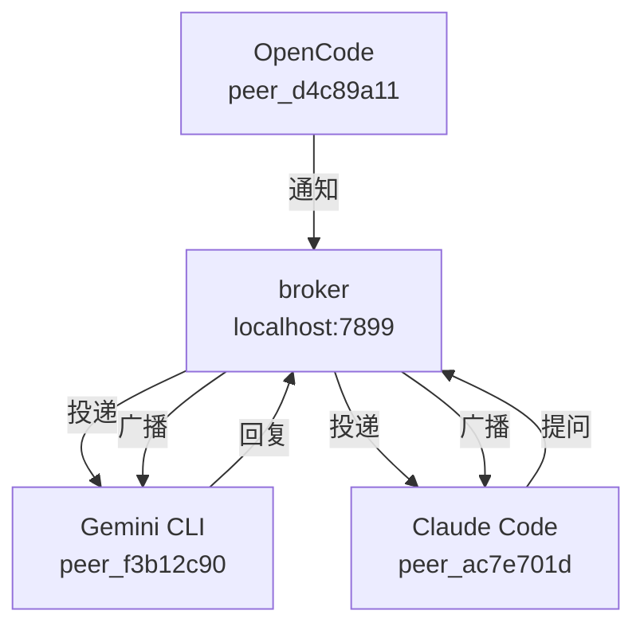

# agents-mesh

[Read in English](README.md) · [Leer en español](README.es.md)

> **早期测试版** — 核心功能可用，v1.0 发布前 API 可能有所变动。

**让你的 AI 智能体互相对话。**

当你在不同终端运行多个 AI 编程智能体时 —— Claude Code 负责前端，Gemini CLI 负责后端，OpenCode 负责 API —— 它们彼此毫不知情。每个智能体都在自己的孤岛中工作。你成了中间人：复制粘贴上下文、传递决策、维持同步。

agents-mesh 让你从这个循环中解脱出来。

它在智能体之间创建一个轻量级通信网格，让它们能够互相提问、共享上下文、协调工作 —— 无需你介入。

<!-- GIF: 两个终端 + 仪表板实时显示智能体通信 -->

---

## 工作原理

每个智能体在启动会话时获得一个唯一 ID（`peer_ac7e701d`、`peer_f3b12c90`...），并加入本地网格。之后它们可以互相发现、提问、共享上下文 —— 全部通过自然语言完成。



无需云服务。无需账户。一切运行在本地。

---

## 安装

```bash
curl -fsSL https://raw.githubusercontent.com/luisestebanveragomez/agents-mesh/main/scripts/install.sh | bash
```

支持 macOS（arm64、x64）和 Linux（x64、arm64）。Windows 用户请使用 [WSL](https://learn.microsoft.com/windows/wsl/install)。

然后将 agents-mesh 添加到你的 AI 智能体：

```bash
agents-mesh install claude-code
agents-mesh install gemini-cli
agents-mesh install opencode
agents-mesh install copilot
agents-mesh install codex
```

重启你的智能体 —— 它们现在已连接。

```bash
agents-mesh installed   # 验证安装
agents-mesh dashboard   # 打开可视化仪表板
```

---

## 示例

**在 Claude Code 中** —— 发现活跃的智能体并提问：

> *"列出活跃的 peers"*

> *"问 peer_f3b12c90 这个项目用了哪些技术"*

**在 Gemini CLI 中** —— 接收方查看消息：

> *"检查是否有新消息"*

Gemini CLI 看到问题，在代码库中查找答案并回复。Claude Code 自动收到答案 —— 你全程无需切换终端。

---

## 仪表板

```bash
agents-mesh dashboard
```

打开 `http://localhost:5723` —— 实时查看所有活跃智能体、它们的当前任务以及彼此之间流动的消息。

<!-- screenshot: 显示智能体关系图的仪表板 -->

---

## 智能体能做什么

| 工具 | 功能 |
|------|------|
| `peers_list` | 查看所有活跃智能体及其当前任务 |
| `peers_ask` | 向另一个智能体提问并等待回答 |
| `peers_notify` | 向所有智能体广播消息 |
| `peers_check` | 查看收到的消息 |
| `peers_reply` | 回复收到的消息 |
| `peers_search` | 找出哪个智能体对某个主题有上下文 |
| `peers_status` | 更新当前任务和状态 |

---

## 支持的智能体

| 智能体 | 安装命令 |
|--------|----------|
| Claude Code | `agents-mesh install claude-code` |
| Gemini CLI | `agents-mesh install gemini-cli` |
| OpenCode | `agents-mesh install opencode` |
| GitHub Copilot | `agents-mesh install copilot` |
| Codex | `agents-mesh install codex` |
| Cursor、Windsurf、Cline、Roo... | [手动配置 ↓](#其他智能体) |

### 其他智能体

任何兼容 MCP 的智能体均可使用。手动将以下内容添加到其配置文件：

```json
{
  "mcpServers": {
    "agents-mesh": {
      "command": "agents-mesh",
      "args": ["mcp"]
    }
  }
}
```

---

## CLI 命令参考

```
agents-mesh install <agent> [--global|--local]    添加到 AI 智能体
agents-mesh uninstall <agent> [--global|--local]  从 AI 智能体移除
agents-mesh uninstall --all                       从所有智能体移除
agents-mesh installed [agent]                     查看安装状态
agents-mesh list                                  列出活跃 peers
agents-mesh ask <target> <问题>                   向另一个 peer 提问
agents-mesh notify <消息>                         通知所有 peers
agents-mesh check                                 查看待处理消息
agents-mesh reply <msg_id> <回复>                 回复消息
agents-mesh status [--task <t>] [--status <s>]   更新状态
agents-mesh register [--role <r>] [--agent <n>]  手动注册（不使用 MCP）
agents-mesh doctor                                诊断安装问题
agents-mesh dashboard                             打开网页仪表板
```

---

## 高级安装

```bash
# 自定义安装目录
AGENTS_MESH_INSTALL_DIR=~/.local/bin curl -fsSL .../install.sh | bash

# 安装指定版本
AGENTS_MESH_VERSION=v0.2.0 curl -fsSL .../install.sh | bash

# 从源码安装
git clone git@github.com:luisestebanveragomez/agents-mesh.git
cd agents-mesh && bun install && bun link
```

---

## 卸载

```bash
agents-mesh uninstall --all        # 从所有智能体移除
sudo rm /usr/local/bin/agents-mesh # 删除二进制文件
```

---

## 许可证

MIT — 查看 [LICENSE](LICENSE)。
