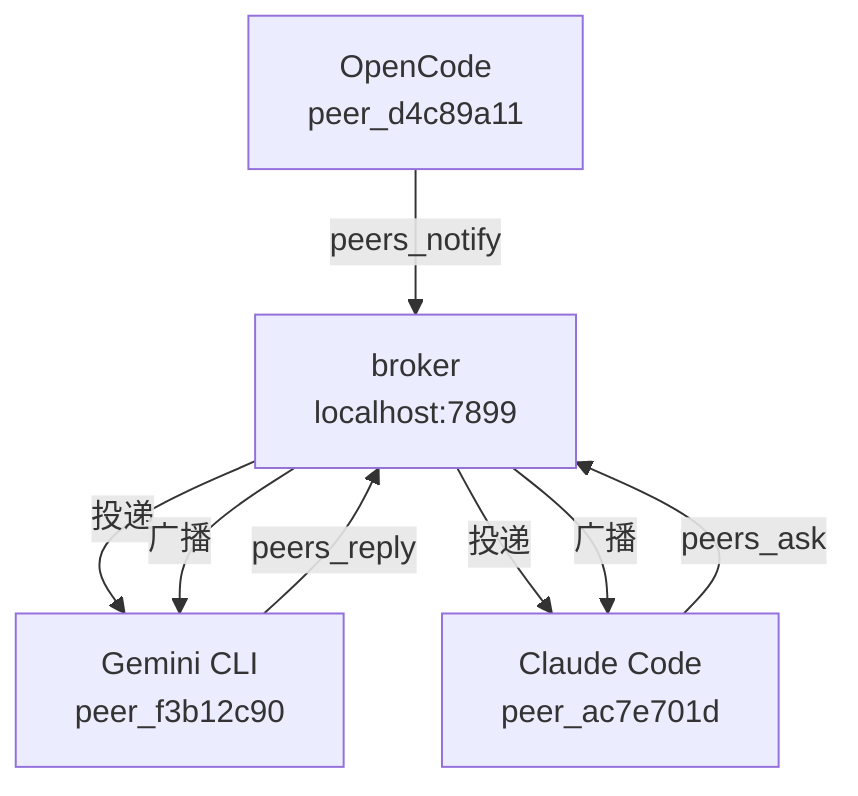

<div align="center">
  
  <h1>agents-mesh</h1>
</div>

[Read in English](README.md) · [Leer en español](README.es.md)

> **早期测试版** — 核心功能可用，v1.0 发布前 API 可能有所变动。

**为 AI 编程智能体提供轻量级通信网格。**

当你在不同终端运行多个 AI 编程智能体时 —— Claude Code 负责前端，Gemini CLI 负责后端，OpenCode 负责 API —— 它们彼此毫不知情。每个智能体都在自己的孤岛中工作。

**没有 agents-mesh 时**，你就是中间人：
- Claude 询问认证库 → 你切换到 Gemini，问完再把答案复制回去
- Gemini 修改了某个模型 → 你手动通知 Claude 和 OpenCode
- 每一个决策都要经过你

**有了 agents-mesh**，智能体通过本地网格直接通信。你不再是路由器。

<!-- GIF: 两个终端 + 仪表板实时显示智能体通信 -->

---

## 工作原理

**01 — 注册。** 智能体配置了 agents-mesh 并启动后，会连接到本地 broker（`localhost:7899`）并获得一个唯一 ID，例如 `peer_ac7e701d`。broker 由 agents-mesh 自动启动 —— 你无需手动管理。每个智能体定期发送心跳包，让 broker 知道谁仍然活跃。

**02 — 发现。** 任何智能体都可以调用 `peers_list` 查看所有活跃 peer：它们的 ID、智能体类型和当前任务。这就是 Claude 知道 Gemini 存在的方式。

**03 — 提问。** Claude 调用 `peers_ask(target="peer_f3b12c90", question="...")`。broker 暂存消息，直到目标智能体来轮询。

**04 — 回复。** Gemini 调用 `peers_check` 看到消息，查找答案后调用 `peers_reply`。broker 将回复路由回 Claude 等待中的 `peers_ask` 调用。

**05 — 广播。** 任何智能体都可以调用 `peers_notify` 向所有人广播 —— 无需回复。适合通告重要变更（"我刚修改了 User 模型 —— email 字段现在可以为空"）。

消息是临时的 —— 它们存在于内存中，broker 重启后即消失。



无需云服务。无需账户。无持久化存储。一切运行在本地。

---

## 安装

**第一步 —— 安装二进制文件：**

```bash
curl -fsSL https://raw.githubusercontent.com/luisestebanveragomez/agents-mesh/main/scripts/install.sh | bash
```

支持 macOS（arm64、x64）和 Linux（x64、arm64）。Windows 用户请使用 [WSL](https://learn.microsoft.com/windows/wsl/install)。

**第二步 —— 将 agents-mesh 添加到你想要连接的每个 AI 智能体：**

```bash
agents-mesh install claude-code
agents-mesh install gemini-cli
agents-mesh install opencode
agents-mesh install copilot
agents-mesh install codex
```

默认为全局安装（影响所有项目）。使用 `--local` 仅在当前目录安装。

**第三步 —— 重启你的智能体。** 它们会在启动时自动注册到 broker。

**第四步 —— 验证安装：**

```bash
agents-mesh installed       # 查看所有智能体的安装状态
agents-mesh dashboard       # 打开网页仪表板
```

---

## 操作示例

以下演示 Claude Code 向 Gemini CLI 提问的过程。每个代码块代表你在独立终端中的操作。

**终端 1 —— Claude Code 会话**

让 Claude 查找活跃的 peers：

> "使用 peers_list 查看谁已连接"

Claude 调用 `peers_list` 并收到类似以下内容：

```
peer_ac7e701d  claude-code   正在进行前端重构
peer_f3b12c90  gemini-cli    空闲
```

现在向 Gemini 提问：

> "问 peer_f3b12c90 这个项目用的是哪个认证库"

Claude 以 `peer_f3b12c90` 为目标调用 `peers_ask` 并附上问题。broker 暂存该消息。

**终端 2 —— Gemini CLI 会话**

让 Gemini 查看消息：

> "检查是否有来自其他智能体的消息"

Gemini 调用 `peers_check` 并看到：

```
msg_7f3a  来自 peer_ac7e701d："这个项目用的是哪个认证库？"
```

Gemini 在代码库中查找，找到答案后回复：

> "回复 msg_7f3a：项目使用 Passport.js 配合 JWT token，配置文件在 src/auth/passport.ts"

**终端 1 —— 回到 Claude Code**

Claude 的 `peers_ask` 调用返回了 Gemini 的回复。Claude 现在拥有了答案 —— 你全程无需切换上下文。

---

## 工具参考

以下是每个已连接智能体可用的 MCP 工具。

| 工具 | 参数 | 功能说明 |
|------|------|---------|
| `peers_list` | _（无）_ | 返回所有当前活跃的智能体，包括其 peer ID、智能体名称及当前任务/状态 |
| `peers_ask` | `target`（peer ID 或 "all"）、`question`（字符串）、`timeout_ms`（可选） | 向指定 peer 发送问题并等待回复。阻塞直到收到回复或超时 |
| `peers_check` | _（无）_ | 返回发给本智能体的所有待处理消息。非破坏性操作 —— 消息在回复前一直保留 |
| `peers_reply` | `message_id`（字符串）、`content`（字符串） | 向 `peers_check` 返回的指定消息 ID 发送回复 |
| `peers_notify` | `message`（字符串） | 向所有活跃智能体广播消息，不需要回复 |
| `peers_search` | `topic`（字符串） | 根据各 peer 注册的任务和近期活动，询问 broker 哪个 peer 对某主题有相关上下文 |
| `peers_status` | `task`（可选字符串）、`status`（可选字符串） | 更新本智能体的当前任务描述和状态，其他智能体可通过 `peers_list` 看到 |

**示例 —— Claude Code 向 Gemini 询问数据库架构：**

```
peers_ask(target="peer_f3b12c90", question="数据库有哪些表？请总结一下 schema。")
```

**示例 —— OpenCode 通知所有 peer 有重要变更：**

```
peers_notify(message="我刚修改了 User 模型 —— email 字段现在可以为空。请更新你们的查询语句。")
```

**示例 —— Gemini 更新自己的状态：**

```
peers_status(task="审查 API 错误处理", status="in_progress")
```

---

## CLI 命令参考

`agents-mesh` 二进制文件也可直接在终端使用，无需通过 AI 智能体。

```
agents-mesh list                               列出活跃 peers
agents-mesh ask <target> <问题>                向另一个 peer 提问
agents-mesh reply <msg_id> <回复>              回复消息
agents-mesh notify <消息>                      通知所有 peers
agents-mesh check                              查看待处理消息
agents-mesh status [--task <t>] [--status <s>] 更新状态

agents-mesh install <agent> [--global|--local] 添加到 AI 智能体
agents-mesh uninstall <agent> [--global|--local] 从 AI 智能体移除
agents-mesh uninstall --all                    从所有智能体移除
agents-mesh installed [agent]                  查看安装状态
agents-mesh update                             更新到最新版本

agents-mesh doctor                             诊断安装问题
agents-mesh dashboard                          打开网页仪表板

agents-mesh mcp                                启动 MCP 服务器（stdio）
agents-mesh broker                             手动启动 HTTP broker

agents-mesh --version                          显示已安装版本
```

---

## 仪表板

```bash
agents-mesh dashboard
```

在浏览器中打开 `http://localhost:5723`。仪表板显示：

- **活跃智能体** —— 所有已连接的 peer，包括其 ID、智能体类型和当前任务
- **网络图** —— 实时可视化哪些智能体正在相互通信
- **消息历史** —— 带时间戳的近期消息、提问、回复和广播记录
- **近期活动** —— 整个网格中事件的时间顺序动态流

仪表板自动刷新，无需登录。

---

## 支持的智能体

| 智能体 | 安装命令 | 修改的配置文件 |
|--------|----------|--------------|
| Claude Code | `agents-mesh install claude-code` | `~/.claude.json`（全局）或 `.mcp.json`（本地） |
| Gemini CLI | `agents-mesh install gemini-cli` | `~/.gemini/settings.json`（全局）或 `.gemini/settings.json`（本地） |
| OpenCode | `agents-mesh install opencode` | `~/.config/opencode/opencode.json`（全局）或 `opencode.json`（本地） |
| GitHub Copilot CLI | `agents-mesh install copilot` | `~/.copilot/mcp-config.json`（全局）或 `.copilot/mcp-config.json`（本地） |
| Codex | `agents-mesh install codex` | `~/.codex/config.json`（全局）或 `codex.json`（本地） |

### 其他智能体

任何兼容 MCP 的智能体均可使用。手动将以下内容添加到其 MCP 配置文件：

```json
{
  "mcpServers": {
    "agents-mesh": {
      "command": "agents-mesh",
      "args": ["mcp"]
    }
  }
}
```

对于使用不同 MCP 配置格式的智能体（如 OpenCode），请查阅该智能体的文档了解正确的配置结构。

---

## 高级安装

**自定义安装目录：**

```bash
AGENTS_MESH_INSTALL_DIR=~/.local/bin curl -fsSL https://raw.githubusercontent.com/luisestebanveragomez/agents-mesh/main/scripts/install.sh | bash
```

**安装指定版本：**

```bash
AGENTS_MESH_VERSION=v0.2.8 curl -fsSL https://raw.githubusercontent.com/luisestebanveragomez/agents-mesh/main/scripts/install.sh | bash
```

**从源码安装：**

```bash
git clone https://github.com/luisestebanveragomez/agents-mesh.git
cd agents-mesh
bun install
bun link
```

---

## 更新

```bash
agents-mesh update
```

下载并安装最新版本。agents-mesh 也会在每次运行时静默检查更新，如有新版本可用则显示提示。

---

## 卸载

从所有 AI 智能体移除 agents-mesh：

```bash
agents-mesh uninstall --all
```

然后删除二进制文件：

```bash
sudo rm /usr/local/bin/agents-mesh
# 如果安装到了自定义目录：
rm ~/.local/bin/agents-mesh
```

---

## 常见问题

**离线时能用吗？**

可以。broker 完全在本地运行。安装好二进制文件后无需网络连接。

**智能体之间的通信安全吗？**

消息仅在本地网络传输，不会离开你的机器。智能体之间没有身份验证 —— 机器上任何知道 broker 端口的进程都可以参与通信。请勿将 7899 端口暴露到网络。

**智能体断开连接后会怎样？**

broker 检测到心跳缺失后会将该 peer 标记为不活跃。发给该 peer 的待处理消息会保留在 broker 队列中直到过期。其他智能体在 `peers_list` 中将不再看到已断开的 peer。

**消息存储在哪里？**

仅存储在内存中。消息是临时的 —— broker 重启后即消失。没有持久化存储，没有数据库，没有云同步。

**不同机器上的两个智能体能通信吗？**

不能直接通信。broker 仅监听本地地址。你可以使用 SSH 端口转发来隧道化流量，但这不是官方支持的配置。

---

## 贡献

参见 [CONTRIBUTING.md](CONTRIBUTING.md)。

---

## 许可证

MIT —— 查看 [LICENSE](LICENSE)。
